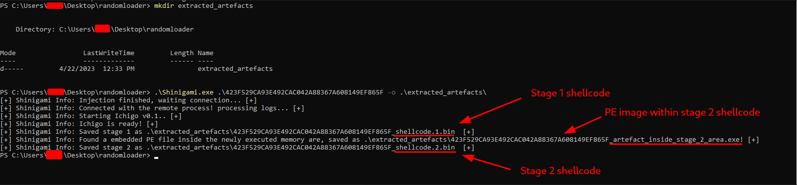

# Shinigami
[](https://github.com/buzzer-re/Shinigami/actions/workflows/ci.yml)
[](https://github.com/buzzer-re/Shinigami/actions/workflows/cd.yml)

<figure>

</figure>


Shinigami is an experimental tool designed to detect and unpack malware implants that are injected via process hollowing or generic packer routines. 

# How this works
The tool operates by hooking NT functions related to Process Hollowing and marking newly executable memory pages with the page guard bit. This technique allows Shinigami to detect indirect flow changes, typically caused by shellcode or unpacked code, which are often indicative of malware.
Shinigami creates the target executable in a suspended state and injects a DLL library called "Ichigo". This library automatically hooks every necessary function to detect and extract the implant. Once the artefact is fully extracted, the tool will kill the process.

Shinigami effectiveness may vary depending on the specific malware it is targeting. However, it is a valuable addition to any malware analysis toolkit and may prove useful in detecting and analyzing malware that uses process hollowing or generic packer routines.

***Important: This is a dynamic unpacking tool and should not be run on your personal machine or in a static analysis lab***


# Current unpack methods

## Process Hollowing
  
Shinigami's core method for extracting implants injected using process hollowing involves hooking two NT functions: NtResumeThread and NtWriteVirtualMemory. Here's how it works:
  - `NtResumeThread` Hook
    - Shinigami hunts through all the previously allocated memory via NtAllocateVirtualMemory to check if it contains the DOS header signature. If found, it extracts the remote PE file, patches it to have the sections aligned, and saves it on disk with the format ***filename_dumped.bin***.
    
  - `NtWriteVirtualMemory` Hook
    - Shinigami detects if the executable is trying to write a PE file in the remote process by hooking NtWriteVirtualMemory. If a PE file is found, it is extracted using the Buffer pointer and saved on disk as ***filename_before_written.bin***, this option is only used if the flag `--stop-at-write` is passed.

## Generic unpacker
Shinigami's generic unpacker module marks newly allocated memory areas with the PAGE_GUARD bit, it also applies this bit if any existing memory area has its protections replaced by something executable. By using guard pages, it can track which memory area is going to be used to allocate some shellcode or PE images.

For each shellcode detected, Shinigami saves the raw shellcode itself on disk. It also scans that memory region to find any PE files and saves them as well. Shinigami treats every different shellcode execution as a new stage, so by the end, you will have your working directory with files called `filename_shellcode_STAGENUM.bin or .exe`.


 
## Usage

The tool has a couple of options:


```bash
Usage: Shinigami [--help] [--version] [--output VAR] [--stop-at-write] [--verbose] [--only-executables] [--exported VAR] program_name

Positional arguments:
  program_name                  Name of the program to execute

Optional arguments:
  -h, --help                    shows help message and exits
  -v, --version                 prints version information and exits
  -o, --output                  Directory to dump artefacts
  --stop-at-write               Unhollow: Stop the execution when the PE file is being to be written
  --verbose                     Display a verbose output
  -p, --only-executables        Only extract PE artefacts
  -e, --exported                Exported Function: Choose a exported function to execute if the target is a DLL (rundll will be used)
```

Some important options are:

***-o, --output***: Specifies the directory to dump the extracted artifacts. By default, extracted artifacts will be saved to a directory called output in the current working directory. You can specify a different directory by passing its path as an argument.

***--stop-at-write***: This argument is used during the unpacking of a hollowed process. When Shinigami detects that the PE file is being written to the hollowed process, it will stop the execution and save the extracted PE file. This option can be useful if you want to avoid executing the entire hollowed process and only need to extract the unpacked code.

***--verbose***: Displays a verbose output. This can be useful for debugging or understanding the inner workings of Shinigami.


### Example usage:
## Unhollow

||
|:--:|
|Testing against Dridex|

After the extraction is done, the process is killed and you will have (I hope so) the extracted PE:

||
|:--:|
|Dumped implant|


The detected implant will be dumped following the format described at [detection methods](#current-detection-methods) section

## Unpacking

||
|:--:|
|Unpacking a random loader described [here](https://reversing.codes/posts/Manual-unpacking-in-details/)|

In the example above, Shinigami automatically detected the behavior of a generic loader and extracted all the executed shellcodes and images within it, without requiring any specific switches to enable or disable the unpacking routine. This was possible because Shinigami shares some functions with the unhollow module, using shared hooks provided by the [Gancho](https://github.com/buzzer-re/gancho) library.


## Emotet

||
|:--:|
|Unpacking Emotet DLL|

Shinigami also has DLL support and the ability to rebuild injected binaries using detached DOS headers. Notably, malware samples like Emotet use this technique to evade in-memory PE scanners. Shinigami detects such missing parts (DOS header) and employs heuristics to reconstruct them.

## Installing

Grab your flavor at the [Release](https://github.com/buzzer-re/Shinigami/releases) page.

## Building and hacking 

It would be amazing if you help this project, so if you want here is the dependencies and steps


- Install Visual Studio >= 2019 with the C++ workload.
- Install [Zydis](https://github.com/zyantific/zydis), a fast and lightweight x86/x86-64 disassembler, I recommend use the [vcpkg](https://github.com/zyantific/zydis#building-zydis---using-vcpkg) method.
  - Zydis is used to make sure that the api hooking more precise and to ensure that no opcode is lost when copying.
- Open the Shinigami.sln solution file in Visual Studio and build/code the project.

Please open an issue or pull request for any changes you would like to make.

## Conclusion

This cool mascot image was inspired on Bleach and generated by [Dall-E](https://openai.com/product/dall-e-2).

